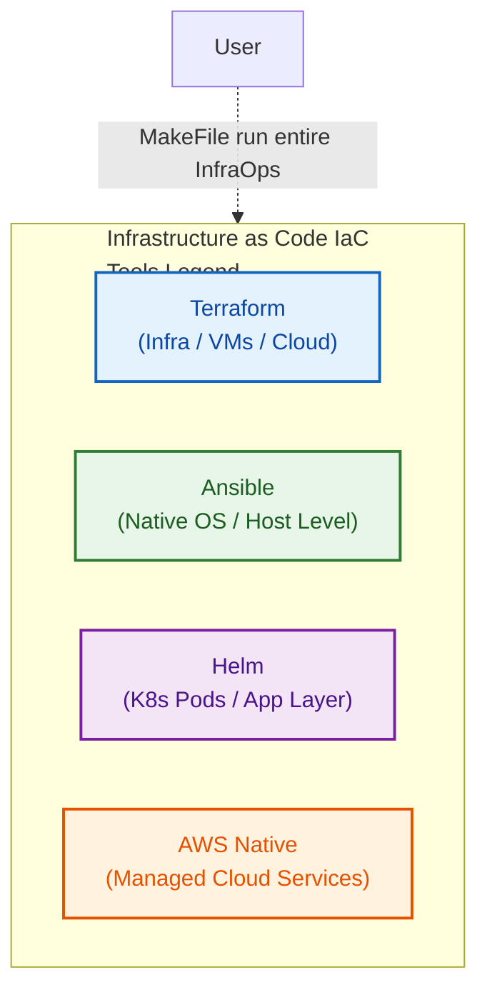
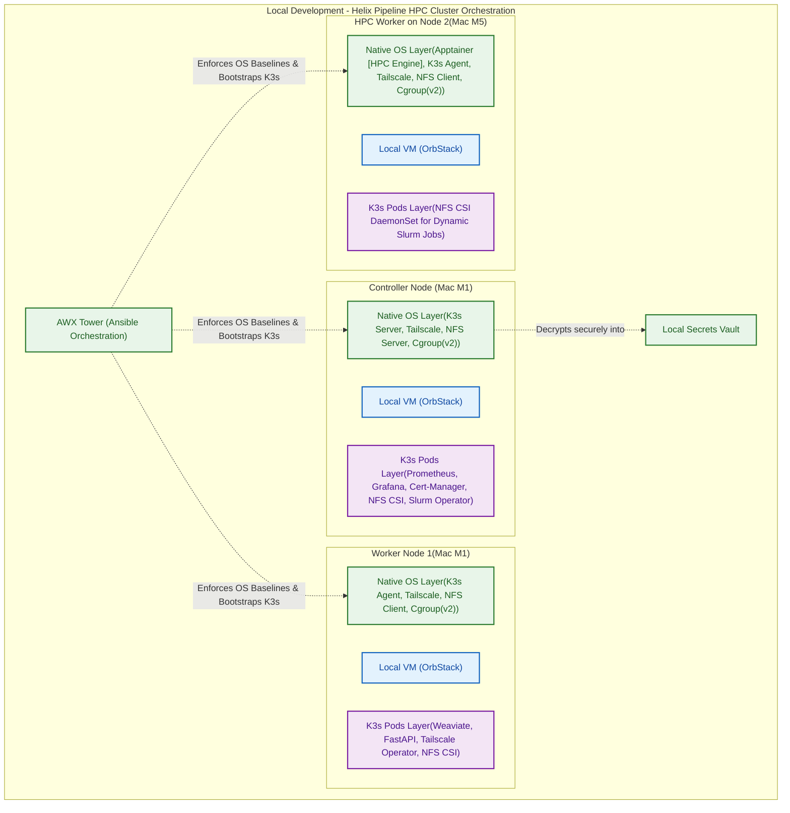
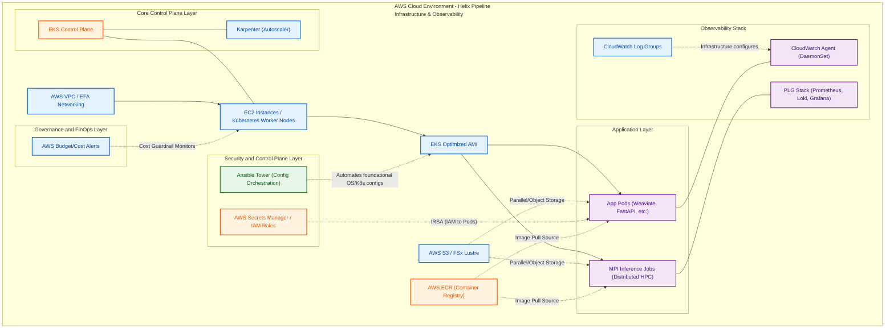

# HelixScale: Hybrid HPC Platform

> Production-grade HPC platform engineering for GPU-accelerated computational biology workloads — from bare metal to cloud, scalable from single node to multi-cluster.

[](https://www.python.org/downloads/)
[](https://www.terraform.io/)
[](LICENSE)
[](https://github.com/astral-sh/uv)

---

## What This Project Demonstrates

HelixScale is a working HPC orchestration platform that provisions GPU clusters, schedules BioNeMo/ESM2 protein-folding workloads across Slurm and Kubernetes, and monitors everything through a full observability stack. 

This project covers the full lifecycle that platform engineering and AI infrastructure roles demand:
- **Infrastructure Provisioning** — Terraform modules for VPC, GPU compute, and EFS persistent storage on AWS EKS / Azure AKS.
- **Cluster Configuration** — Ansible roles for Slurm, NVIDIA driver installation, CUDA toolkit, and container runtimes.
- **Workload Orchestration** — DAG-based pipeline engine that chains protein folding stages.
- **FinOps Governance** — Automatic resource reclamation to prevent budget overruns (Zero-Cost Idle Policy).
- **Security & Compliance** — Automated vulnerability scanning, secrets management integration, and compliance validation.

---
## Helix Pipeline: Dual-Node Hybrid HPC Cluster Orchestration
A production-grade, end-to-end data engineering pipeline designed for distributed structural biology workloads. This architecture automates a complete headless execution lifecycle—Infrastructure as Code (Terraform) $\rightarrow$ Configuration Management (Ansible) $\rightarrow$ Application Orchestration (Helm)—to ingest raw mmCIF files, execute localized distributed CPU cleaning jobs via an HPC Slurm cluster, and route vectorized workloads to an ephemeral AWS EKS cluster for GPU-bound deep learning inference.Designed as a strict, resource-bounded system optimized for Apple Silicon virtualization framework and AWS cost guardrails, this project demonstrates cross-host network meshing, zero-trust secrets injection, and strict lifecycle decoupling between the host operating system and cloud workloads.

## Technical Overview
#### 🏗️ Architectural Paradigm & Blast Radius Control

To achieve absolute environment stability and maintain continuous uptime across uneven hardware barriers, this pipeline enforces a rigorous separation of duties. Hardware allocations are decoupled via State Separation—maintaining isolated Terraform states across physical machines to eliminate a single point of failure and prevent multi-node state locking or corruption.The software topology is governed by a strict rule of thumb:The Foundation Layer (Native OS via Ansible): Strictly reserved for components requiring direct interaction with the Linux kernel, physical hardware interfaces, or low-level container runtimes (e.g., host-level Tailscale routing engines, kernel-level NFS directory exports, Cgroup v2 resource isolation limits, and Apptainer execution runtimes).The Cargo Layer (Application Workspace via Helm/Kubectl): Isolated applications that consume compute resources rather than providing them (e.g., Weaviate Vector DB, FastAPI ingestion gateways, Prometheus stacks, and the Slurm Operator) are containerized cleanly as K3s pods to separate lifecycle modifications from host stability.

#### 🛡️ Secure Mesh Networking & Secrets Bridging

Because the physical nodes reside across distinct local hypervisors and separate network zones, communication is unified via a headless WireGuard-backed Tailscale Mesh network. Headless VMs utilize pre-authorized, ephemeral authentication keys generated deterministically during the Terraform provisioning flight, bypassing interactive browser login loops.Secrets management matches this hybrid infrastructure: local deployments employ file-backed, zero-trust token injections during host initialization, while the AWS cloud layer utilizes Terraform-managed AWS Secrets Managers bridged dynamically to active Kubernetes pods via the External Secrets Operator.

#### The Orchestration Sequence (Dependency Chain)

The master pipeline adheres to a unidirectional execution flow to guarantee that networking, mounting protocols, and runtime dependencies are structurally verified before application layers are initialized:


Phase,Core Tool,Operational Domain,Responsibility
1. Provision,Terraform,Host Hypervisor (OrbStack) / AWS Core,"Disk carving, vCPU/RAM quotas, and Tailscale token pre-authorization. Generates a dynamic .ini inventory file to disk upon successful exit code 0."
2. Configure,Ansible,Host OS Layer (SSH via Private Tailnet),"Kernel tuning, mounting NFS utils, establishing OS baselines, starting the Tailscale daemon, and bootstrapping K3s Server/Agents."
3. Deploy,Helm,Kubernetes API (Active Cluster Control),"Injecting application overrides (values.yaml), registering the NFS CSI driver, setting Prometheus memory caps (2 GB), and initializing the Weaviate Vector DB payload."

## Architecture Overview

HelixScale operates on a strict **Control vs Compute Plane** model. This ensures that the local environment (Control Plane) manages orchestration and security, while the heavy lifting occurs in the scalable cloud (Compute Plane).


### Infrastructure as Code Workflow
HelixScale IaC handled by Terraform, Ansible, Helm and AWS cloud services. To keep clear distinction of IaC tools provisioning and manging this hybrid infrastructure color coded consistently accross the system architecture for easy visualization<div align="center">

</div>

### Local Environment Setup of HelixScale
To better map IaC to HelixScale tool orchestration view, the nodes are color coded following the above Iac architecture. <div align="center">

</div>

### [DRAFT-Version-In\Progress] Cloud Environment Setup of HelixScale

<div align="center">


</div>

### Deployment Strategy
HelixScale is designed to be environment-agnostic, parameterizing its targets so that `dev`, `staging`, and `prod` configurations remain cleanly separated within the same pipeline toolchain.

---

## Running the Project (Make Commands)

HelixScale abstracts operations behind a unified `Makefile`. Use environment variables to target different setups (e.g., `ENV=prod`).

### Environment Setup & Testing
- `make setup` : Initializes the local environment, sets up `uv` virtual environment, and installs dependencies.
- `make lint` : Runs `ruff` checks/formatting and `mypy` type checking.
- `make test` : Executes the unit test suite.

### Infrastructure Deployment (Terraform)
- `make ENV=dev tf-plan` : Initializes and runs `terraform plan` for the specified environment.
- `make ENV=dev tf-apply` : Executes the infrastructure deployment for the specified environment.

### Configuration Management & Workloads
- `make ENV=dev ansible-deploy` : Runs Ansible playbooks to configure the provisioned nodes.
- `make ENV=dev helm-deploy` : Deploys Kubernetes workloads via Helmfile to the configured cluster.

### Housekeeping
- `make clean` : Removes Python cache directories (`__pycache__`, `.pyc`, `.pytest_cache`, etc.).

---

## Project Structure

```
helixscale/
├── Makefile                   # Unified entrypoint for all ops (parameterized by ENV)
├── README.md                  # Project overview, architecture, and quickstart
├── ARCHITECTURE.md            # System architecture details
├── src/                       # Application source code (Python, CLI, orchestrator)
│   └── helixscale/
├── tests/                     # Unit and integration tests
├── infra/                     # Infrastructure and Configuration
│   ├── terraform/             # IaC: Cloud resources (VPC, EKS, Node Groups, Storage)
│   ├── ansible/               # Configuration Management: OS-level setup (Slurm, drivers)
│   └── helm/                  # Kubernetes Deployments: Operators, PLG observability
├── pipelines/                 # CI/CD workflows, DAGs, BioNeMo/ESM2 workload definitions
└── docs/                      # Unified view of project documentation
```

---

## Tech Stack

| Layer | Technologies |
|-------|--------------|
| **Core** | Python 3.12+, Bash, UV, Typer, Pydantic |
| **Infrastructure** | Terraform, Ansible |
| **Containers** | Docker, Apptainer (rootless HPC), NVIDIA Container Toolkit |
| **Orchestration** | Slurm, Kubernetes (EKS/AKS) |
| **Workloads** | NVIDIA BioNeMo (ESMFold) |
| **Observability** | Prometheus, Grafana, Loki, DCGM Exporter |
| **CI/CD & Security** | GitHub Actions, AWS Secrets Manager |

---

## The BioNeMo Workload

Real Bronze-level protein structure prediction using NVIDIA BioNeMo and Meta's ESM-2. Processes 3D structures from the Protein Data Bank (PDB).

```text
PDB FASTA Input → Tokenization → ESMFold Inference → PDB Output + pLDDT Scores → HTML Report
```

---

## License

MIT License. See [LICENSE](LICENSE) for more details.

---

## Contribution
This project is an end-to-end orchestration of AI/HPC workload for LifeScience's built on unique Hardware. This project cannot be replicated on same hardware. That said: 

This project is meant to be a production grade portfolio project by me, not expecting code contributions. 

Highly Encouraged Contributions:
1. Peer review of PRs.
2. Raise PR to point any inconsistency

---

<p align="center">
Built with purpose. Equipped to ship.
</p>
