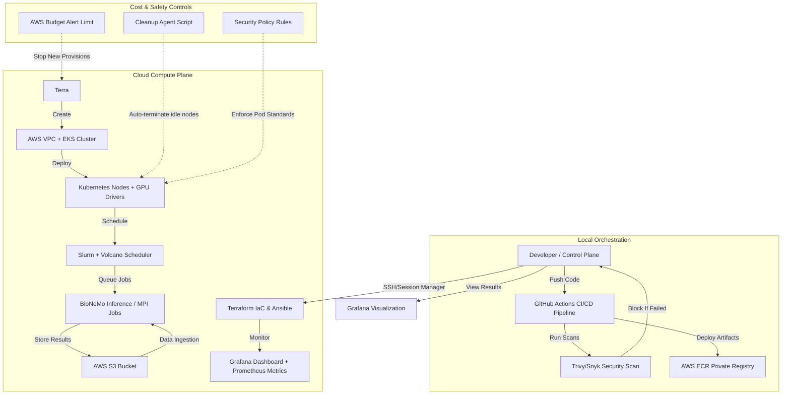

# HelixScale: Hybrid HPC Platform

> Production-grade HPC platform engineering for GPU-accelerated computational biology workloads — from bare metal to cloud, scalable from single node to multi-cluster.

[](https://www.python.org/downloads/)
[](https://www.terraform.io/)
[](LICENSE)
[](https://github.com/astral-sh/uv)

---

## What This Project Demonstrates

HelixScale is a working HPC orchestration platform that provisions GPU clusters, schedules BioNeMo protein-folding workloads across Slurm and Kubernetes, and monitors everything through a full observability stack. 

This project covers the full lifecycle that platform engineering and AI infrastructure roles demand:
- **Infrastructure Provisioning** — Terraform modules for VPC, GPU compute, and EFS persistent storage on AWS EKS / Azure AKS.
- **Cluster Configuration** — Ansible roles for Slurm, NVIDIA driver installation, CUDA toolkit, and container runtimes.
- **Workload Orchestration** — DAG-based pipeline engine that chains protein folding stages.
- **FinOps Governance** — Automatic resource reclamation to prevent budget overruns (Zero-Cost Idle Policy).
- **Security & Compliance** — Automated vulnerability scanning, secrets management integration, and compliance validation.

---

## Architecture Overview

HelixScale operates on a strict **Control vs Compute Plane** model. This ensures that the local environment (Control Plane) manages orchestration and security, while the heavy lifting occurs in the scalable cloud (Compute Plane).



### Deployment Strategy
HelixScale is designed to be environment-agnostic, parameterizing its targets so that `dev`, `staging`, and `prod` configurations remain cleanly separated within the same pipeline toolchain.

---

## Running the Project (Make Commands)

HelixScale abstracts operations behind a unified `Makefile`. Use environment variables to target different setups (e.g., `ENV=prod`).

### Environment Setup & Testing
- `make setup` : Initializes the local environment, sets up `uv` virtual environment, and installs dependencies.
- `make lint` : Runs `ruff` checks/formatting and `mypy` type checking.
- `make test` : Executes the unit test suite.

### Infrastructure Deployment (Terraform)
- `make ENV=dev tf-plan` : Initializes and runs `terraform plan` for the specified environment.
- `make ENV=dev tf-apply` : Executes the infrastructure deployment for the specified environment.

### Configuration Management & Workloads
- `make ENV=dev ansible-deploy` : Runs Ansible playbooks to configure the provisioned nodes.
- `make ENV=dev helm-deploy` : Deploys Kubernetes workloads via Helmfile to the configured cluster.

### Housekeeping
- `make clean` : Removes Python cache directories (`__pycache__`, `.pyc`, `.pytest_cache`, etc.).

---

## Project Structure

```
helixscale/
├── Makefile                   # Unified entrypoint for all ops (parameterized by ENV)
├── README.md                  # Project overview, architecture, and quickstart
├── ARCHITECTURE.md            # System architecture details
├── src/                       # Application source code (Python, CLI, orchestrator)
│   └── helixscale/
├── tests/                     # Unit and integration tests
├── infra/                     # Infrastructure and Configuration
│   ├── terraform/             # IaC: Cloud resources (VPC, EKS, Node Groups, Storage)
│   ├── ansible/               # Configuration Management: OS-level setup (Slurm, drivers)
│   └── helm/                  # Kubernetes Deployments: Operators, observability
├── pipelines/                 # CI/CD workflows, DAGs, BioNeMo workload definitions
└── docs/                      # Standardized project documentation
```

---

## Tech Stack

| Layer | Technologies |
|-------|--------------|
| **Core** | Python 3.12+, Bash, UV, Typer, Pydantic |
| **Infrastructure** | Terraform, Ansible |
| **Containers** | Docker, Apptainer (rootless HPC), NVIDIA Container Toolkit |
| **Orchestration** | Slurm, Kubernetes (EKS/AKS), Volcano |
| **Workloads** | NVIDIA BioNeMo (ESMFold) |
| **Observability** | Prometheus, Grafana, Loki, DCGM Exporter |
| **CI/CD & Security** | GitHub Actions, Trivy, AWS Secrets Manager |

---

## The BioNeMo Workload

Real Bronze-level protein structure prediction using NVIDIA BioNeMo and Meta's ESM-2. Processes 3D structures from the Protein Data Bank (PDB).

```text
PDB FASTA Input → Tokenization → ESMFold Inference → PDB Output + pLDDT Scores → HTML Report
```

---

## License

MIT License. See [LICENSE](LICENSE) for more details.

---

<p align="center">
Built with purpose. Designed to ship.
</p>
